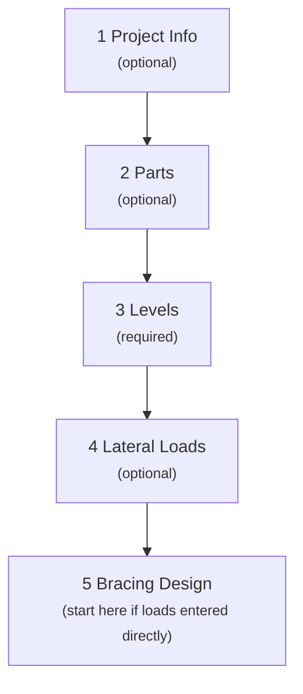

# User Manual and Technical Specification
# StructToolKit: Structural Load Designer
(Version: 1.0a)

Design Standard: NZS 3101, NZS 1170.2, NZS 1170.5

---

## 1. Development Environment
The RC Beam Designer application is built with a modern, lightweight front-end stack to ensure fast performance, maintainability, and compatibility across platforms.
-   **Framework:** React V18+
-   **Build Tool:** Vite
-   **Language:** Typescript
-   **Styling:** Tailwind CSS + Shadcn UI
-   **State and Schema:** Zustand, Zod
-   **Utilities:** UUID for unique identifiers
-   **Compatibility:** Optimized for modern browsers including Chrome, Firefox, Edge, and Safari

## 2. Appication and Interface Overview

The application supports vertical and lateral load calculations as well as bracing design. The user interface is designed to be clear, intuitive, and responsive, ensuring a smooth workflow for structural design tasks. The main layout is divided into following key areas:

### 2.1 Sidebar
The sidebar provides quick access to project and application-level controls:
-   **Project Setup:** Input project inofmation. Start new project, save and load project files for continued work.
-   **Parts:** Create a building part from typical products in the market.
-   **Levels:**  Configure building levels from the parts built previously or predefined parts.
-   **Analysis:** Analysis of seismic and wind actions.
-   **Bracing:** Bracing layout desgin as per NZS3604.
-   **Setting:** Toggle between light and dark modes.
-   **Help & About** Basic information about the application.

### 2.2 Navigation & Manage Panel
The secondary side panel provides management or navigation between different design sections:
-   **Project Setup:** Save/load project data (not available in current version).
-   **Parts:** Create a new building part, delete or rename parts in the list.
-   **Levels:** Create a new building level, delete, rename or reorder a level in the list.
-   **Analysis:** Navigation to Seismic Weight, Seismic Design, Wind Pressure and Wind Action sections.
-   **Bracing:** Add new bracing section, delect or rename section for bracing layout design.

### 2.3 Main Panel
The main panel allows users to define inputs and review results for the active section in the sidebar:
-   **Project Setup:** – Define project name, designer, and design notes, etc.
-   **Parts:** – Build a building part (e.g., a roof) structure from the component libarary (in the right panel). TDefine the dimensions and material properties of each component.
-   **Levels:** – Build a building level from the parts. Define the level height, roof pitch, and other geometry parameters. It needs to note that the plan dimensions (N-S and E-W) are indicated as the total length of the level along the directions respectively.
-   **Analysis:** – Input seismic and wind parameters (NZS 1170.5, NZS 1170.2, NZS 3604), and run analysis to generate design actions based on the levels setup.
-   **Bracing** – Design the bracing layout for the demend bracing for each bracing section.

## 3. Getting Started
This section provides an overview of the workflow for setting up and running a loads design in the application.
### 3.1 Design Workflow
Follow these steps to move through the design process. You may skip the optional steps if they are not required for your project. For example:
- if the level only contains NZS 3604 parts (like a light-weight roof and walls), you may skip the **Parts** section and directly start from **Levels** section. 
- If the lateral loads are provided directly (e.g., from an external analysis), you may skip the **Analysis** section and start from **Bracing** section.

### 3.2 Job Setup
Use the Project Setup section in the main panel:
* Enter project information such as project name, designer, and notes.
* Load and save a project data using the buttons (not available in current version).
>💡Note: This information will be used for generating the report title block in future development.

### 3.3 Create Building Parts
A building part represents a structural element (e.g., a roof, floor, or wall). Each part is composed of various components (layers) that contribute to its overall weight and structural properties. For example, a roof part may include layers such as roofing material, waterproof layer, insulation, timber rafters and ceiling structure below.
1. Use the plus icon in the **Navigation & Manage Panel** to add a new part. A dialog will prompt you for the part name or allow you to select a predefined part from the dropdown list.
2. Once a part is created or activated, define the **Part Type** and **Slope** at the top of the main panel.  
  The solpe is available for roof and floor parts only and affects the vertical load, which is based on the horizontal projection area.
3. Add components from the **Component Library** in the right panel, The required parameters differ by component type:
  - Area-based: Components like plywood panels. Thickness is required.
  - Solid-member-based: Components like timber rafters. Cross-section dimensions and spacing are required.
  - Count-based: Components like trusses. Spacing is required.
4. Use "Add Custom Layer" button to add a custom component with user-defined unit-area-weight.
> **💡Note:** The weight of some products is an estimated value. Simply modifying a parameter like thickness may introduce a tolerance. It is recommended to create a custom layer using the manufacturer-specified unit-area-weight if precise values are needed.

### 3.4 Configure Building Levels
A building level represents a horizontal slice of the structure at a specific height. Each level can contain multiple parts (e.g., roof, floor, walls) that contribute to its overall geometry and load distribution.

In this application, levels should contain the considered horizontal structures (e.g., roof, floor), and the vertical parts (e.g., walls) below the level. For example, a level at the first floor should include the first floor structure and the walls below it (ground floor walls). The walls above the level (first floor walls) will be included in the next level (second floor level). The ground level on grade is not contributing to the lateral loads and is not required to be defined.

**Levels Configuration Steps:**
1. Use the plus icon in the **Navigation & Manage Panel** to add a new level.
2. Once a level is created or activated, define the level height, and plan dimensions (N-S and E-W lengths).
  - The plan dimensions are indicated as the total length of the level along the directions respectively.
  - **Crucial Note for Wind:** Understanding these dimentions is crucial for the wind load calculations, as the NS wind load is applied on the EW faces, and the EW wind load is applied on the NS faces. Refer to the figure below for clarification.
  
3. Rename, delete or reorder levels using the menu button in the level tag.
  - The order of levels listed here should match the actual construction order of the building from **bottom (top of the list) to top**.  This is essential for accurate loading areas and load path calculations. Always review the level order before running the analysis, and reorder if necessary.
4. **Assign parts to a level:** add parts from the list in the right panel. Different parameters are required based on the part type:
  - **Roof parts:** Define the roof projected area and average height (a typical average height is half the roof height from the eave level to the ridge).
  - **Floor parts:** Define the projected area.
  - **Wall parts:** Define the wall length, wall height (which affects the weight), and an opening ratio factor (default 1.0; reduce if there are significant openings).
  - **Partition walls:** Define the projected area only. The weight is calculated based on an average unit-area-weight of 0.3 kPa. The area should typically be the total floor area of the level.
  - **Other parts:** Define the projected area or a factor with a base-weight of 1.0 kPa. For example, for a permanent equipment item with a weight of 500 kg, the factor should be 5 for a total weight of 5 kN.
5. The total weight of the level is automatically calculated based on the assigned parts and their properties.
6. Predefined parts based on **NZS 3604** definitions are available for quick selection. Users may modify their parameters as needed.
> **💡Note:** The value of **storey height** affects the wind actions at the level and distribution the seismic actions. The **wall height** only affects the weight of the wall part.

### 3.5 Analysis of Lateral Loads

The **Analysis** stage is divided into four sections to calculate the seismic and wind design actions: **Seismic Weight**, **Seismic Design**, **Wind Pressure**, and **Wind Action**.

#### **1. Seismic Weight**

This section allows users to review and fine-tune the seismic weight ($\sum Q_i$) of each level, which is automatically calculated from the assigned parts.

| Parameter | Details |
| :----- | :------ |
| **Live Load (LL) on Floors** | Review/adjust the live loads, which are used in the calculation of seismic mass as per NZS 1170.1 and NZS 3604. *Note: Live loads on roofs are neglected in seismic weight calculations.* |
| **Wall Height Factor** | Used to account for the wall mass contributing to the diaphragm at the level (e.g., floor structure, ceiling frame). The default value is **0.5**, meaning the bottom-half of the wall above and (or) the top-half of the wall below the diaphragm level are considered. |
| **Apply LL Area Factor** | Check this box to apply the live load area reduction factor as per NZS 1170.1. |
| **Calculate Weights** | Weights are usually calculated automatically upon parameter changes. This button manually triggers the weight calculation if needed (e.g., after changing the "Apply LL Area Factor" checkbox). |

#### **2. Seismic Design**

This section calculates the design lateral forces based on NZS 1170.5 Equivalent Static Method (Clause 6.2.1).

**Inputs:**
*   Seismic parameters as per NZS 1170.5: Seismic Zone, Site Subsoil Class, First Period ($T_1$), Building Importance Level, Design Life, and Ductility Factor ($\mu$).

**Outputs:**
*   The design spectral acceleration parameters ($C_h(T)$ and $C_d(T_1)$) are calculated based on the inputs. Users can **override** the inputs if a site-specific response spectrum is used.
*   The **Seismic Base Shear** ($V_i$) and the **Design Lateral Forces** ($F_i$) at each level are calculated using the Equivalent Static Method (NZS 1170.5 Clause 6.2.1).

> The *Calculate Actions* button is highlighted if input changes require the analysis to be re-run.

#### **3. Wind Pressure**

This section provides two options for calculating wind pressure:

| Method | Required Input | Details |
| :--- | :--- | :--- |
| **Default Method (NZS 3604)** | **Site Wind Zone** (as per NZS 3604) | Uses the roof average height to determine the wind pressure at the roof level, referencing BRANZ Study Report SR 168. |
| **Additional Method (NZS 1170.2)** | **Roof Slope** and **Site Wind Speeds** | Enabled via a checkbox. Calculates wind pressures at the eave and floor levels using a simplified method from NZS 1170.2 Section 5.4. |

**Pressure Coefficient and Wall Notes:**

*   The external coefficients for roof and wall ($C_{pw}$ and $C_{pr}$) are calculated based on the inputs.
*   **Gable End Walls:** Check the box if the building has gable end walls. The wind pressures on the gable wall will be calculated using the coefficients for wall windward and leeward, not the roof coefficients.
*   The wall height contribution to the diaphragm level is always considered as **0.5 of the storey height** in the wind pressure calculations.

#### **4. Wind Actions**

In this section, users determine the final wind actions for bracing design.

*   **Action Selection:** Select from the dropdown list to use the results of the NZS 3604 method, the NZS 1170.2 method, or the maximum values obtained from both.
*   **Combination Factor:** The default value is **0.9**, typically ranging from 0.8 to 1.0.
*   **Internal Pressure:** Note that internal pressure is not considered for the lateral load calculations on walls, as it is deemed insignificant for most residential and light commercial buildings.

> The *Calculate Actions* button is highlighted if input changes require the analysis to be re-run.

### 3.6 Bracing Design

In the bracing design stage, users design the bracing members and layout for each bracing section, ensuring compliance with **NZS 3604** or **NZS 4229**.

The **Demand Bracing Units (BUs)** for each level and direction are automatically filled based on the lateral load analysis. Users may **override** these values if needed (e.g., for additional loads like a chimney structure, or from an external analysis).

The bracing sections are automatically created based on the levels setup (one section per level per direction, NS and EW).

#### **1. Bracing Sections Panel**

A bracing section typically represents a level in a specific project direction (NS or EW).

*   Use the plus icon in the **Navigation & Manage Panel** to **add a new bracing section** (e.g., for a large wing part of the building).
*   Use the **menu button** in the section tag to rename or delete a bracing section.

#### **2. Bracing Line Configuration**

The bracing layout is defined by adding and configuring bracing lines within each section.

*   Use the ➕ icon to **add bracing lines** (a minimum of 2 lines is required for each section).
*   Use the **Arrow Buttons** to delete or reorder the bracing lines.
*   **For each bracing line:**
    *   Input the **label** and the **external wall length**.
    *   Add/remove bracing elements (rows in the table) using the ➕ or 🗑️ icons.
    *   Select the **bracing system** and **type** to auto-populate the bracing rate (BUs/m or BUs/unit).

**Bracing Rate Lookup:**
*   Choose from predefined systems or use custom entries:
    *   **Common 1:** $100\text{ BUs/m}$ — rate based on length (height-sensitive).
    *   **Common 2:** $100\text{ BUs/unit}$ — rate based on number (height-insensitive).

Use these common bracing member then adjust the length or number to meet the specific design needs. For example, a bracing member with a rate of $125\text{ BUs/m}$ and a length of 2 m provides $250\text{ BUs}$ of bracing capacity, input as 2.5 m of the "Common 1" bracing type.
#### **3. Compliance Check**

The application provides checks against key **NZS 3604** provisions:

##### Minimum Bracing Line Demand
Each bracing line must satisfy the **greater** of:
*   50% of the average total demand of lines in the section
*   $100\text{ BUs}$
*   $15\text{ BUs} \times \text{external wall length}$

##### Bracing Rate Limits

| Bracing System | Maximum Limit | Connection Requirement |
| :--- | :--- | :--- |
| **Length-based systems** (BUs/m) | Max $120\text{ BUs/m}$ on timber floors | Reflects connection capacity study |
| | Max $150\text{ BUs/m}$ on concrete floors | |
| **Number-based systems** (BUs/unit) | No upper limit | **Connections must be Specifically Engineered Design (SED)** |

##### Height Sensitivity
*   Bracing rates based on **length** (BUs/m) are affected by wall height.
*   Bracing rates based on **number** (BUs/unit) are not height-dependent.

##### Bracing Rate Table
The bracing system (products) these are supported by the tool are listed below. 
| Bracing System |  Type  | Notes |
|----------------|--------|-------|
| Gib Bracing |  -- | |
| James Hardie |  -- | |
| Ecoply |  -- | |
| PlyTech |  -- | |
| Existing Assessment |  -- |Standard sheet lining* |
| Subfloor |  -- | As per NZS3604|

## 4. Predefined Parts

The application provides two categories of predefined parts to streamline the design process: **Detailed Building Parts** (used for creating custom parts with layers) and **Simplified Level Part Instance** (used for quickly assigning weights to a level based on NZS 3604).

### 4.1 Detailed Building Parts (Used in 3.3 Create Building Parts)

These parts are pre-configured with multiple layers and components, giving a more detailed representation of the structure. They serve as a starting point for the user to quick create custom parts.

| Part Name | Part Type | Key Components | Total Weight (Unit-Area-Weight, kPa) |
| :--- | :--- | :--- | :--- |
| **Metal Roof** | Roof | Corrugated Steel, Timber Batten, Timber Rafter (190x45), Plaster Board | $\approx 0.32$ |
| **Timber Floor** | Floor | Particle/Flake Board, Timber Joist (190x45), Timber Batten, Plaster Board | $\approx 0.36$ |
| **Weatherboard Wall** | Wall | Timber Weather Board, Timber Batten, Timber Stud (90x45), GIB Braceline | $\approx 0.35$ |
| **Brick Veneer Wall** | Wall | Brick Veneer, Timber Stud (90x45), GIB Braceline | $\approx 1.50$ |
| **PCP Wall + Lining** | Wall | Precast Concrete Panel (100mm), Timber Packer, Plaster Board | $\approx 2.62$ |

### 4.2 Simplified Level Parts (Used in 3.4 Configure Building Levels)

These simplified options are based on the common mass assumptions from **NZS 3604** and can be added directly when configuring building levels for rapid load input. They use a single `baseWeight` (Unit-Area-Weight in kPa) for calculation.

| Part Name | Part Type | Base Weight (kPa) | Reference / Description |
| :--- | :--- | :--- | :--- |
| **Light Roof - NZS3604** | Roof | $0.45$ | Typical light roof cladding as per NZS 3604. |
| **Heavy Roof - NZS3604** | Roof | $0.85$ | Typical heavy roof cladding. |
| **Light Cladding Wall - NZS3604** | Wall | $0.5$ | Typical light weight wall cladding (e.g., weatherboard, fibre cement). |
| **Medium Cladding Wall - NZS3604** | Wall | $0.8$ | Typical light weight wall cladding (e.g., weatherboard, fibre cement). |
| **Heavy Cladding Wall - NZS3604** | Wall | $2.2$ | Typical heavy wall cladding (e.g., masonry veneer). |
| **Floor - NZS3604** | Floor | $0.45$ | Typical timber or light concrete floor structure. |
| **Partition Wall** | Other | $0.3$ | Represents non-structural partition walls based on an average unit-area-weight. |
| **Other** | Other | $1.0$ | A generic part for items with a user-defined weight factor (where $1.0 \text{ factor} = 1.0\text{ kPa base weight}$). |

> **Note:** The weights for all predefined parts are provided for convenience. Users should **verify** that these values accurately represent the materials used in their specific project, especially when customising or using them as a base.

## 5. Considerations of Seismic Design

This chapter details the key parameters and assumptions used in the seismic design analysis, as per **NZS 1170.5**.

### Live Load Contribution

| Consideration | Details |
| :--- | :--- |
| **Roof Live Loads** | Live loads on roofs are **neglected** in seismic mass calculations. |
| **Floor Live Loads** | Live loads on floors contribute to the seismic mass. |
| **Combination Factor ($\Phi_E$)** | Can be applied as per NZS 1170.5 Cl 4.2: $0.6$ for storage floors and $0.3$ for other floors. |
| **Area Reduction Factor ($\Phi_a$)** | Can be applied based on the floor area $A$ in $\text{m}^2$ as per NZS 1170.1: $\Phi_a = 0.3 + 3 / \sqrt{A}$. |
| **Snow Load** | Snow load is not considered in current version |

> **Note on $\Phi_a$:** This factor is **not** applied to floors covered by types C3, C4, C5, F, or G (NZS 1170.1 Table 3.1), floors with storage exceeding $5 \text{ kPa}$, one-way slabs, or floors supporting SED equipment/machinery.

### Wall Height Contribution

*   The **Wall Height Factor** accounts for the wall mass contributing to the diaphragm at the level.
*   **Default Value:** $0.5$ (bottom-half of the wall above and/or top-half of the wall below the diaphragm).
*   **NZS 3604 Assumption:** Due to typical window openings in the top half of walls, NZS 3604 assumes a factor of $\mathbf{0.33}$ (top one-third of the wall below the diaphragm).
*   **User Action:** Users should review and adjust this factor based on the actual wall configuration and opening layout.

### Parameters as per NZS 1170.5

The seismic design parameters should be selected based on project conditions.

| Parameter | Guideline |
| :--- | :--- |
| **Seismic Zone ($\mathbf{Z}$)** | Automatically looked up based on the selected region using NZS 1170.5 Table 3.3. Custom input is allowed for site-specific hazard assessment. |
| **First Period ($\mathbf{T_1}$)** | Can be estimated based on building height and structural system (NZS 1170.5). For light timber-framed buildings, $0.4\text{ seconds}$ for 2-storey is typical. *Verify this value with a structural engineer or detailed dynamic analysis if necessary.* |
| **Design Life** | Reflects the intended lifespan (e.g., $50\text{ years}$ for residential, $100\text{ years}$ for critical infrastructure). |
| **Importance Level** | Selected based on the function of the building (higher levels for essential facilities) as per NZS 1170.0. |
| **Ductility Factor ($\mathbf{\mu}$)** | Reflects expected performance. A value of $2.0\text{ to } 2.5$ is often recommended for light timber-framed buildings to avoid underestimation of seismic demands (compared to typical $\mu=3.0-3.5$). *Consult a structural engineer for dual-system or complex projects.* |
| **Damping Ratio, $\zeta_e$** | Typically **5%** for most timber-framed buildings. Adjust as required by specific material standards if other systems are present. |
| **Performance Factor ($\mathbf{S_p}$)** | Calculated as per NZS 1170.5 Section 4.4. *Note: May differ from specific material standards (e.g., NZS 3101).* |

### Seismic Load Distribution

The distribution of lateral forces ($F_i$) is calculated using the Equivalent Static Method (NZS 1170.5 Clause 6.2.1.3 Eq 6.2(2)):

$$ F_{i} = F_{t} + 0.92 V \frac { W_{i} h_{i} } { \sum _ { i=1 } ^ { n } ( W _ {i} h _ {i} ) } $$

Where:
*   $F_i$: Lateral design force at level $i$.
*   $V$: Seismic base shear.
*   $W_i$: Seismic weight of level $i$.
*   $h_i$: Height of level $i$ above the base.
*   $F_t$: Additional load at the top level ($0.08 V$ for the top level, $0$ for other levels).

> The distribution is influenced by the mass and height of each level, with higher levels typically experiencing greater forces.

## 6. Considerations of Wind Actions

### NZS 3604 Method

Wind zone determination should be in accordance with **NZS 3604 Chapter 5**. User may use GIS maps (e.g., BRANZ map or local council GIS map) which are usually sufficient for preliminary design.

#### Site Wind Speed and Pressure

| Wind Zone | Wind Speed ($\mathbf{m/s}$) | Dynamic Pressure ($\mathbf{q/C_{fig}}$, kPa) |
| :--- | :--- | :--- |
| Low | Up to 32 | $0.62$ |
| Medium | 32 to 37 | $0.82$ |
| High | 37 to 44 | $1.16$ |
| Very High | 44 to 50 | $1.56$ |
| Extra High | 50 to 55 | $1.82$ |

#### Assumptions for NZS 3604

*   **Building Height:** Overall building height is limited to $\mathbf{10\text{ m}}$ from the lowest ground point to the roof apex.
*   **Building Width:** The bracing demand calculation assumes a building width of $\mathbf{7.2\text{ m}}$ for roof pitch considerations. Bracing demand for buildings wider than $7.2\text{ m}$ may be greater than technically required by the standard.

#### Net $\mathbf{C_{pe}}$ Factors for Roof (Used for Lateral Load)

The net $C_{pe}$ values are based on the average height above the eave, which is the horizontal resultant allowing for upwind and downwind slopes:

| Height Above Eave ($\mathbf{m}$) | Net $\mathbf{C_{pe}}$ |
| :--- | :--- |
| $1.0$ | $0.24$ |
| $2.0$ | $0.40$ |
| $3.0$ | $0.70$ |
| $4.0$ | $0.85$ |
| $5.0$ | $1.20$ |

> **Note:** The roof height is calculated as a weighted average, using the roof area of each building part as the weighting factor. This approximation is suitable for mono-pitch and gable roofs, and slightly conservative for long-ridge hip roofs when individual roof part heights are used. 
For roof shapes with a plan form close to a square (e.g., short-ridge hip roofs), the average roof height may be input within the range of 0.5 to 1.0. Note that a lower average roof height results in a lower roof pressure coefficient, as shown in the table above.

To ensure a conservative and safe design, while defining a roof part of a level:
- Use 0.7 to 0.8 times the roof height for roofs incorporating triangular slopes.
- Use 1.0 times the roof height for mono-pitch, gable, or long-ridge hip roofs.
 
#### Net $\mathbf{C_{pe}}$ Factors for Walls
The net $C_{pe}$ value for walls (including gable ends) is taken as $0.7$ for the windward wall and $-0.5$ for the leeward wall, resulting in a total pressure coefficient of $1.2$.

### NZS 1170.2 Method (Simplified)

The simplified method provided is based on **NZS 1170.2 Section 5.4** and relies on the following assumptions:
*   The building is regular in vertical and plan with a simple roof form.
*   The coefficients are estimated based on general width, depth, and height ratios, and upwind/downwind slopes for the roof.

**This method is expected to result in a more accurate pressure compared with the NZS 3604 method for the defined conditions.** A specific engineering design is required for buildings with complex shapes.

#### Simplified External Pressure Coefficients for Walls ($\mathbf{C_{pw,l}}$)

Values below are for the leeward wall, based on the width/depth ratio ($d/b$) and roof slope ($\alpha$):

| Roof Slope ($\mathbf{\alpha}$) | $\mathbf{d/b \le 1.0}$ | $\mathbf{1.0 < d/b \le 2.0}$ | $\mathbf{d/b > 2.0}$ |
| :--- | :--- | :--- | :--- |
| $\mathbf{\alpha < 10^\circ}$ | $-0.5$ | $-0.3$ | $-0.2$ |
| $\mathbf{\alpha = 10^\circ \text{ to } 15^\circ}$ | $-0.3$ | $-0.3$ | $-0.3$ |
| $\mathbf{\alpha = 15^\circ \text{ to } 20^\circ}$ | $-0.4$ | $-0.4$ | $-0.4$ |
| $\mathbf{\alpha = 20^\circ \text{ to } 25^\circ}$ | $-0.75$ | $-0.5$ | $-0.5$ |

> **Note:** The roof slope of a building part is not used in the calculation of lateral actions. Refer to the section *“NZS 3604 method”* above for the definition of average roof height.  
However, if the simplfied NZS 1170 method is confirmed for use, the actual average roof height may be input directly to define the part. For example, roofs incorporating triangular slopes may adopt 0.5 times the full roof height as a reasonable approximation. 
This flexibility allows for more accurate representation of roof geometry, particularly where the NZS 1170 wind loading provisions are applied. Users should ensure that the selected average height aligns with the roof shape and pressure coefficient assumptions. Where uncertainty exists, conservative input values are recommended to maintain design safety.

#### Simplified External Pressure Coefficients for Roof ($\mathbf{C_{p,r}}$)

Values below are for the roof (upwind, downwind and 0.2 for internal pressure), based on the height/depth ratio ($h/d$) and roof slope ($\alpha$):

| Roof Slope ($\mathbf{\alpha}$) | $\mathbf{h/d \le 0.25}$ | $\mathbf{0.25 < h/d \le 0.5}$ | $\mathbf{0.5 < h/d \le 0.75}$ | $\mathbf{h/d > 0.75}$ |
| :--- | :--- | :--- | :--- | :--- |
| $\mathbf{\alpha < 10^\circ}$ | $-0.6$ | $-0.65$ | $-0.8$ | $-1.2$ |
| $\mathbf{\alpha = 10^\circ}$ | $-0.6$ | $-0.8$ | $-0.95$ | $-1.1$ |
| $\mathbf{\alpha = 15^\circ}$ | $-0.5$ | $-0.7$ | $-0.8$ | $-0.9$ |
| $\mathbf{\alpha = 20^\circ}$ | $-0.7$ | $
-0.8$ | $-0.7$ | $-0.6$ |
| $\mathbf{\alpha = 25^\circ}$ | $-0.9$ | $-1.0$ | $-1.0$ | $-1.0$ |
| $\mathbf{\alpha = 30^\circ}$ | $-1.3$ | $-1.2$ | $-1.15$ | $-1.1$ |
| $\mathbf{\alpha = 35^\circ}$ | $-1.5$ | $-1.3$ | $-1.28$ | $-1.25$ |

For determining wind pressure coefficients, ceiling values of the dimension ratios ($d/b$ or $h/d$) and roof slope ($\alpha$) are used rather than interpolated values. This approach ensures conservative design outcomes and aligns with the limit of an individual roof slope input.

#### Roof Pressure and Lateral Load

In the analysis of the wind action from the roof on the supporting walls (lateral load), only the **horizontal component** of the roof's external pressure is considered for the diaphragm level.

The lateral component of the pressure coefficient is ultimately given by:
$$C_{pr,h} = - \sin(\alpha) \cdot C_{pr}$$
Where:
*   $C_{pr,h}$ is the horizontal pressure coefficient component.
*   $\alpha$ is the roof slope (pitch).
*   $C_{pr}$ is the external pressure coefficient normal to the roof surface.

> **Note on Load Reduction:** Since the lateral load from the roof is derived from the sine function of the roof pitch, the resulting lateral load is **significantly reduced** where the slope ($\alpha$) is shallow. A steeper roof often transfers a higher proportion of its surface pressure as a lateral load to the supporting structure.

**For roofs with multiple slopes (e.g., hip roof sections):**

The analysis must consider the worst-case scenario. This often involves taking the highest effective pitch ($\alpha$) and the associated maximum pressure coefficient ($C_{pr}$) for the dominant wind direction to ensure the maximum lateral action is captured for the bracing design. The simplified method in the application averages the effects of the windward and leeward slopes to calculate a net effect. Users should exercise caution and consider a specific engineering design if the roof geometry or pressure coefficients are highly irregular.
 
## 7. Future Roadmap & Custom Development

The current Version 1.0a focuses on vertical and lateral load analysis and bracing design for residential or light-commercial buildings. Future development will target a more comprehensive structural modeling framework with the following planned capabilities:

| Feature | Description |
| :--- | :--- |
| **Save and Load Project Data** | Implement functionality to export and import project data files for portability and continued work. |
| **Create Specification Report for Building Parts** | Develop reports detailing building part specifications. This includes extending the component library and incorporating component/product requirements. |
| **Export Loads for Member Design** | Allow the export of part loads in a standardized and normalized format for use in detailed member design. |
| **Cloud Store** | Introduce real-time data storage support for premium users. |
| **Report Generator** | Automated generation of detailed design reports, including calculations, assumptions, and compliance statements. Reports will be exportable in professional formats (PDF, DOCX). |

This roadmap will transform the application from a preliminary design tool into a versatile platform for comprehensive loads analysis and design.

### Support and Contact
For the latest release information, tools, guides, and updates, please visit the:
*   **StructCalcNZ Google Site:** [https://sites.google.com/view/nzsc-team/tools-articles](https://sites.google.com/view/nzsc-team/tools-articles)

For tailored features or custom development, please contact:
*   **Email:** `structcalcnz@gmail.com`

## 8. General Information and Disclaimer

### Usage Suggestions & Troubleshooting

| Action | Details |
| :--- | :--- |
| **Save Data** | **Recommendation:** We strongly recommend saving your design regularly (currently not supported) to avoid data loss.   **To export data:** Use the dedicated “Save Design” function (for the data or similar, where available) to an external file. |
| **App Errors** | **Step 1:** Refresh the web page (note: this will result in loss of existing inputs).   **Step 2:** If the issue persists, close and reopen your browser. |

### Important Notice

**This tool is for preliminary design only.** All design actions and results must be reviewed and approved by an authorized structural engineer prior to use in the next design stage and construction.

### Reporting a Bug / Request for Protected Sheets Password

If you encounter any issues or bugs:
*   **To Report a Bug:** Email us with a detailed description of the issue, including any error messages, steps to reproduce the problem, and your browser type/version.
*   **Contact Email:** `structcalcnz@gmail.com`

### Copyright and Licensing

**© 2025 StructCalcNZ. All rights reserved.**

**Purpose:** This web app is provided as a design tool kit for loads design for residential and light-commercial buildings that fall within the scope of **NZS 3604** or **NZS 4229**. You are free to use this app for non-commercial and commercial purposes.

**Restrictions:**
**Modification of the underlying code, scripts, data, or any internal functionality of this app without explicit permission is strictly prohibited.**

**Disclaimer:**
This tool is **not a substitute** for professional engineering judgment or design for construction purposes. The user assumes full responsibility for all design work and the accuracy of inputs and results. **All designs must be reviewed and approved by an authorized structural engineer or a consent-authorizing reviewer prior to construction.**

For full licensing details, limitations, and warranty disclaimers, please refer to the `LICENSE.txt` file in this repository.

For any queries regarding usage or distribution, or to report a bug, please contact: `structcalcnz@gmail.com`